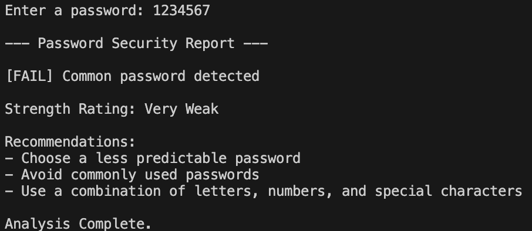
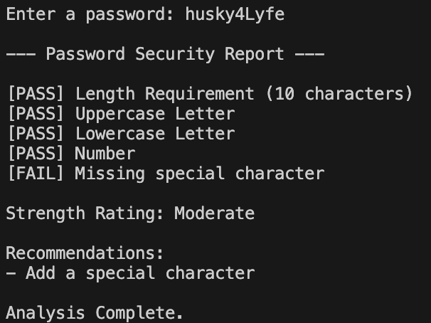
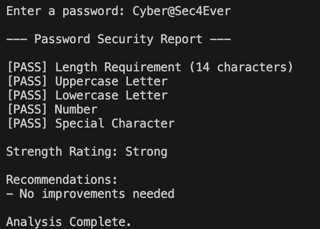

# password-strength-analyzer
Java-based password strength analyzer that evaluates password complexity, detects common passwords, rates password strength, and provides security recommendations.

## Example Output

The examples below demonstrate how the analyzer evaluates password complexity and generates a security report with strength ratings and recommendations.

